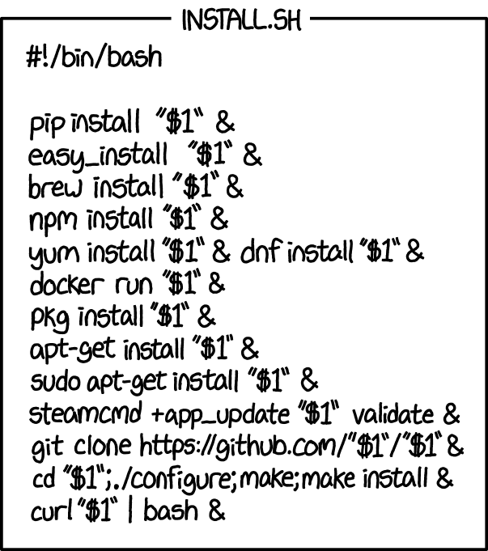

# Command-Line Tools for Linguists, Fall 2024
This course offers a comprehensive exploration of the command-line environment, where we will learn various tools to enhance our productivity and streamline our workflow. Each week, we will tackle different topics related to command-line usage, ranging from navigating UNIX systems to scripting and version control.

| Week    | Overview        | Key Points         |
| ------- | --------------------- | ------------------- |
| Week 1 | Introduction to Command Line Environments |  |
| Week 2 | Navigating a UNIX System |  |
| Week 3 | Basic Corpus Processing |  |
| Week 4 | Advanced Corpus Processing | |
| Week 5 | Scripting and Configuration Files | script, environment variables |
| Week 6 | Installing and Running Programs | |
| Week 7 | Version Control | |

## Week 1 Introduction to Command Line Environments  


- Setting up and launching command-line on Windows using [Ubuntu](https://ubuntu.com/download)
- **Command line basics**
  | Command | Role |
  | ------ | --------------------- |
  | `ls` | list files in a directory |
  | `ls /mnt/c/Users` | list files in a specific Windows directory |
  | `pwd` | show the current directory path |
  | `whoami` | show username |
  | `cp` | copy files |
  | `mv` | move / rename files |
  | `rm` | delete files |
  | `mkdir` | creat a directory |
  | `rmdir` | delete a directory |
  | `cd` | change the working directory |
  | `cat` | display file contents |
  | `less` | view file page by page |
  | `wget` | download files from websites |
- **Quitting applications**
  - Quit `less` using `q`
  - Quit `vim` using `Esc`
  - Quit input (like `cat`) or log out of terminal using `Ctrl+D`
  - Quit text editors (like `nano`) using `Ctrl+X`
  - Quit almost everything using `Ctrl+C`

*Reflection*: 1-3 sentences

## Week 2 Navigating a UNIX System


- **Handling directories**
  - `mkdir` creat a new directory
  - `rmdir` delete empty directory
  - `rm -R` remove directories with content
  - `cp -R` copy directories
  - `mv` move / rename directories
  - `tar` and `gzip` compress directories and files<br>`tar -czf archive.tar.gz /path/to/directory`, `-c`create a new archive, `-z`compress the archive using `gzip.`, `-f`specify the name of the archive file
- **File system**
  - `/home` user home directories
  - `/bin` for essential commands like `ls`
  - `/tmp` for temporary files
  - `which` or `where` return the path of executable files
- **Process management**
  - monitoring processes:<br>
    `top`: displays real-time information about running processes, including their CPU and memory usage.
  - foreground & background processes:<br>
    `&`: at the end of a command, runs that command as a background process<br>
    `fg`: brings a background process to the foreground<br>
    `CTRL+Z`: suspends a foreground process and sends it to the background. paused but not terminated<br>
  - kill processes:<br>
    `ps`: displays information about currently running processes, including their Process IDs (PIDs)<br>
    `kill`: terminates a process by sending a signal, typically using the process’s PID
- **Remote server**
    ```bash
    $ ssh puhti.csc.fi
    $ CTRL+D
    $ scp KIK-LG219/week1/life_of_bee.txt puhti:~
    $ scp puhti:~/life_of_bee.txt .
    ```
  - conneting to remote servers with `ssh` (secure shell)<br>
    `ssh puhti.csc.fi`<br>
    `CTRL+D` or `quit` to quit<br>
    `ssh <username>@<servername>`
  - copying to/from remote servers with `scp` (secure copy protocol)<br>
    `scp <user_1>@<server_1>:<path_1> <user_2>@<server_2>:<path_2>`<br>`scp -r` for directories<br>
    from local to remote: `scp <local_path> <username>@<remote_server>:<remote_path>`<br>
    from remote to local: `scp <username>@<remote_server>:<remote_path> <local_path>`

*Reflection*: 

## Week 3 Basic Corpus Processing


- **Basic text processing**
  - `tr`: `tr "a" "A"` translate characters in a text stream
    - `tr -d`: delete specified characters
    - `tr -c`: keeps only characters *outside* the specified set
    - `tr -s`: squeeze multiple consecutive characters into one<br>`cat filename.txt | tr -s "[:space:][:punct:]" "\n" > new_filename.txt` tokenize the text into one word per line
  - `sort`: `sort new_filename.txt > sort_filename.txt` sort lines in alphabetical order
    - `sort -f`: ignore case
    - `sort -r`: in reverse order
    - ·sort -nr·: sort numerically in reverse
  - `uniq`: remove duplicate lines
    - `uniq -i`: ignore case
    - `uniq -c`: count the number of occurrences of each line
    - `uniq -d`: display only th duplicate lines
    - `uniq -u`: delete all repeated lines, extrace lines that are completely unique
  - `wc`: word count
    - `wc -l`: count the number of lines
  - `cut`: extract specific sections
    - `cut -d',' -f1 file.csv > new_file.csv`: `-d','`specifies the delimiter that separates the fields in the input, `-f1`specifies which field to extract, '1' indicates the first field (or column) from each line
  - `tail`: output the last part of files, also be used to skip the first few lines of a file
    - `tail -n +2 file.csv > tail_file.csv`: `-n +2`start printing from line 2
- **`egrep` and regular expression**<br>
  `egrep` is used for searching text using regular expressions
  - `egrep " had [a-z]*ed "` `*`means the character can occur zero or more times
  - `egrep "\bhad [a-z]*ed\b"` `\b` is used to specify word boundaries
  - `egrep "^[Aa][a-zåäö]*"` `^`beginning of the line
  - `egrep "[a-zA-ZåäöÅÄÖ]*ss[aä]$"` `$` end of the line
  - `egrep "^[a-zA-ZåäöÅÄÖ]{4}ss[aä]$" ` `{}`the preceding character class must occur exactly certain times
  - `egrep --color "\b[a-zåäö]*ss[aä] [a-zåäö]*ss[aä]\b" file.txt > new_file.txt`, highlight and store matching lines in a new file
- **Basic analysis of CSV files**
  ```bash
  $ wc -l Languages.csv
  $ wc -l LanguagesDirectionality.csv
  $ cut -d',' -f1,1 Languages.csv > Languages_cut.csv
  $ cut -d',' -f1,1 LanguagesDirectionality.csv > LanguagesDirectionality_cut.csv
  $ cat Languages_cut.csv LanguagesDirectionality_cut.csv > Languages_all.csv
  $ tail -n +2 LanguagesDirectionality_cut.csv
  $ tail -n +2 LanguagesDirectionality_cut.csv > LanguagesDirectionality_tail.csv
  $ cat Languages_cut.csv LanguagesDirectionality_tail.csv > Languages_all.csv
  $ sort Languages_all.csv > Languages_sorted.csv
  $ uniq -u Languages_sorted.csv
  $ uniq -d Languages_sorted.csv
  $ uniq -u Languages_sorted.csv > Languages_uniq.csv
  $ egrep -w -f Languages_uniq.csv LanguagesDirectionality.csv
  ```
  `egrep -w -f`: `-w` only match whole words, `-f` read a file<br>`egrep -w -f search.csv basic.csv` read the patterns from `search.csv`, and searches through the 'basic.csv' file for lines that match those patterns

*Reflection*:

## Week 4 Advanced Corpus Processing


- **the `sed` command**<br>
  find, replace, substitute ... text<br>
  `-E` for extended regular expressions<br>
  `-n` suppresses line-by-line print, if the output need to be stored in another file, do not use it
  - Basic commands:
    - Delete: `sed '/text/d' file.txt` 
    - Print: `sed -nE '/word/p' file.txt` print lines
    - Substitute: `sed -nE 's/before/after/g' file.txt`
    - `gp`can be combined: `sed -nE 's/before/after/gp' file.txt > newfile.txt`
  - Regular expressions:
    - `sed '/^$/d' delete empty lines
    - `sed -nE '/^start/p' file.txt` finds lines starting with "start"
    - `sed -nE '/end$/p' file.txt` lines ending with "end"
    - `sed -nE '/\bword\b/p' file.txt` find whole words "word"
    - `sed -nE '/abc[d]\{1,3\}/p' file.txt` "abc" followed by 1-3 "d"s
  - Advanced regular expressions:
    - `sed -nE '/that [a-z]+d[ \.,?!:$]/p' file.txt` find "that ...d" and followed by and a space or punctuation, `\` to escape special characters (`.`)
    - `sed -nE 's/that ([a-z]+d)([ \.,:?!$])/that \1 not\2/gp' file.txt` `\N` to refer to the Nth captured group in `()`
    - `sed -E 's/([a-zA-Z]+) \1/\1/g' filename` remove duplicate words, `+` means one or more times (`*` means zero or more times)
- **Pipelines**
  - **word frequency list**
    ```bash
    $ cat file.txt | tr -s '\n\r\t ' '\n' | tr -dc "A-Za-z0-9\n'" | sort | uniq -c | sort -nr > file.freq
    ```
    - `tr -s '\n\r\t ' '\n'` replace all whitespace into newlines and compress extra ones into one
    - `tr -dc "A-Za-z0-9\n-'"` removes characters not specified (anything besides letters, numbers, and a few special characters)<br>
      `"A-Za-z0-9"`can be replaced by `[:alnum:]`(utf-8)
  - **one sentence per line**
    ```bash
    $ cat file.txt | dos2unix | sed 's/^$/#/' | tr '\n' ' ' | sed -E 's/([.?!]) ([A-Z])/\1# \2/g' | sed -E 's/([IVX][.])#/\1/g' | tr '#' '\n' | sed 's/^ *//' | sed 's/ *$//' | grep -v '^$' > file.sent
    ```
    - `dos2unix' changes Windows line endings (\r) to Unix format (\n)
    - `sed 's/^$/#/'` replaces empty lines with # to mark sentence boundaries
    - `tr '\n' ' '` transforms all newlines into spaces, creating one long line of text
    - `sed -E 's/([.?!]) ([A-Z])/\1# \2/g'` punctuation + space + capital letter mark the separation between sentences, also add # to mark sentence boundaries
    - `sed -E 's/([IVX][.])#/\1/g'` removes # if it comes right after a Roman numeral (like IV.)
    - `tr '#' '\n'` converts the # symbols back into newlines, effectively creating one sentence per line
    - `sed 's/^ *//' | sed 's/ *$//'` remove leading and trailing spaces for each line
    - `grep -v '^$''` deletes any empty lines from the output, `grep -v` displays all lines that do *not* match the specified pattern
  - **N-grams**<br>
    N-grams are contiguous sequences of **n** items from a given sample
    ```bash
    $ cat file.sent | sed -E 's/^/# /' | sed -E 's/$/ #/' | sed -E 's/([a-zA-Z]) ([;:,.?!])/\1 \2/g' | tr -s '[:space:]' '\n' > file.unigram
    $ tail -n +2 > file.unigram_plus_one
    $ tail -n +3 > file.unigram_plus_two
    $ paste -d " " file.unigram file.unigram_plus_one file.unigram_plus_two > file.trigram
    $ egrep "^the queen " file.trigram | sort | uniq -c | sort -nr
    ```
    - `sed -E 's/^/# /' | sed -E 's/$/ #/'` add # at the beginning and end of each line
    - `sed -E 's/([a-zA-Z])([;:,.?!])/\1 \2/g'` insert a space between word and punctuation
    - `tr -s '[:space:]' '\n'` create a single-word-per-line output
    - `tail -n +2` `tail -n +3` remove the first/second line
    - `paste -d " " file.unigram file.unigram_plus_one file.uniram_plus_two > file.trigram` combines lines from the three files into a single file, aligning them by space (three words per line)

*Reflection*: hard to follow at the beginning, really need some time to understand the process and concepts

## Week 5


- **Scripts**<br>
  A shell script is a file with a series of commands that can be run together, usually has a `.sh` extension
  ```bash
  #! /bin/bash
  if [ $# -ne 2 ] 
  then
	  echo "ERROR: Two command line qrguments required!"
	  echo "./freqlist.sh input_text_file output_text_file" 
	  exit 1
  fi

  cat $1 | 
  dos2unix |
  tr -s "[:spacce:]" "\n" | 
  tr -d "[:punct:]"
  sort |
  uniq -c |
  sort -nr > $2
  ```
  - `$#` tells how many command-line arguments were passed to the script, `-ne 2`: if not equal to 2
  - `chmod u+x script.sh` add execute permissions to the script
  - `./script.sh file1 file2` run the script
- **Environment variables**<br>
  An environment is a set of environment variables that hold system settings and information accessible to all processes.<br>
  - `printenv` to view all environment variables
  - `echo` to check the value of a variable, like `echo $HOME`
  - `export` to change or create variables, like `export KIK=$HOME/KIK-LG221`
  - `export PATH=$PATH:~/KIK-LG219/week5`, change the $PATH variable to include new directories, allowing the system to find scripts or programs without needing their full path

*Reflection*:

## Week 6



- **Root user**
  - `su` for become root user, password is needed<br>
    `su username` switch to another user
  - `sudo` for temporary root access
- **Python installation**
  - Install software: `sudo apt-get install python3`
  - Manage Python packages: `sudo apt-get install python3-pip`, and then use pip to install packages`pip install package_name`
    ```bash
    $ sudo apt-get install python-pip
    $ pip install nltk
    $ python
    >>> import nltk
    >>> text = "At eight o'clock on Thursday morning Arthur didn't feel very good."
    >>> from nltk.tokenize import word_tokenize
    >>> tokenized =word_tokenize(text)
    >>> print(tokenized)
    ```
  - **Python virtual environment**<br>
    Having multiple Python versions and library versions on the same system can cause conflicts. Solution: Virtual Environments, creating a semi-isolated environment for each project.
    - create: `python3 -m venv KIK-LG219/week6/sample-venv`
    - activate: `source KIK-LG219/week6/sample-venv/bin/activate`
    - exit: `[sample-venv] $ deactivate`
- **Makefile**
  - target file: `data/life_of_bee.no_md.txt`
    ```makefile
    data/life_of_bee.no_md.txt: data/life_of_bee.txt
        python3 src/remove_gutenberg_metadata.py data/life_of_bee.txt data/life_of_bee.no_md.txt
    ```
  - `$<` for the first dependency, `$@` for target：
    ```makefile
    data/life_of_bee.no_md.txt: data/life_of_bee.txt
        python3 src/remove_gutenberg_metadata.py $< $@
    ```
  - use `%` as a placeholder to match filenames
    ```makefile
    %.no_md.txt: %.txt
        python3 src/remove_gutenberg_metadata.py $< $@
    ```
  - run the rule: `make data/life_of_bee.no_md.txt`
- **Makefile for multiple targets**
  ```makefile
  BOOKS=A, B, C, D, E, F, G

  FREQLISTS=$(BOOKS:%=result/%.freq.txt)
  SENTEDBOOKS=$(BOOKS:%=results/%.sent.txt)

  all: $(FREQLISTS) $(SENTEDBOOKS)

  clean:
          rm -f results/* data/*no_md.txt
				
  %.no_md.txt: %.txt
          python3 src/remove_gutenberg_metadata.py $< $@

  results/%.freq.txt: data/%.no_md.txt
          src/freqlist.sh $< $@

  results/%.sent.txt: data/%.no_md.txt
          src/sent_per_line.sh $< $@
  ```
  `make all` / `make clean`
  - variables like `BOOKS` and `FREQLISTS` can store lists of files
  - `FREQLISTS=$(BOOKS:%=result/%.freq.txt)`: for each book in `BOOKS`, create a correspinding filename in `results` directory with a `.freq.txt` extension
  - `all: $(FREQLISTS) $(SENTEDBOOKS)`: defines a target named `all`, for `make all` to run

*Reflection*:

## Week 7


- **Git and GitHub**
  - clone a repository: `git clone https://github.com/username/project.git`
  - check status: `git status`
  - add changes: `git add filename.txt` `git add .`
  - commit changes: `git commit -m "some description"`
  - push changes to GitHub: `git push origin main` `main`or other branches
  - pull changes from GitHub: `git pull origin main`
  - create a new branch: `git checkout -b new-branch`
  - merge a branch: `git checkout main` `git merge new-branch`
  - delete a branch: `git branch -d new-branch`

*Reflection*:
